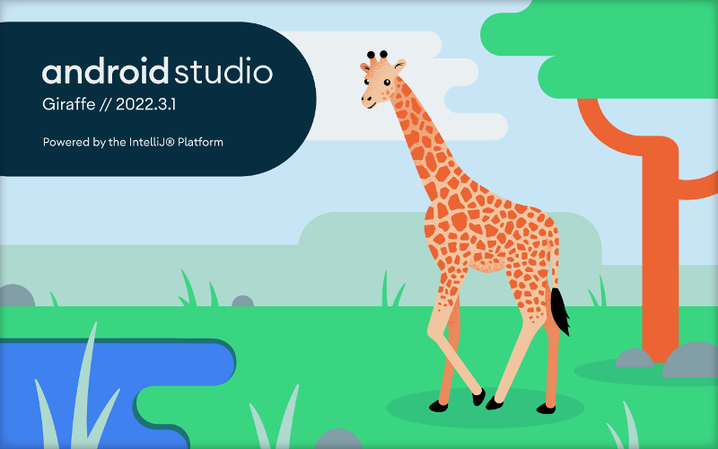
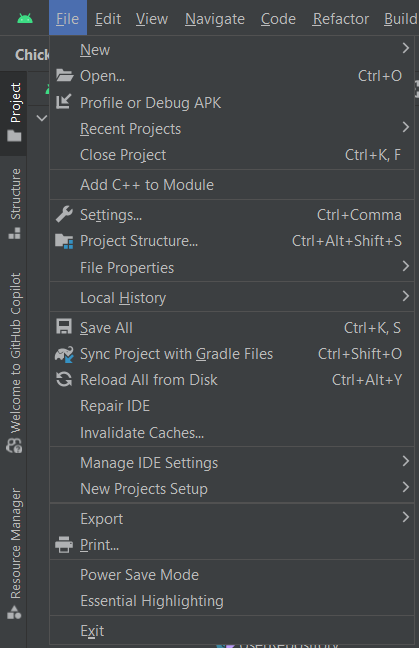
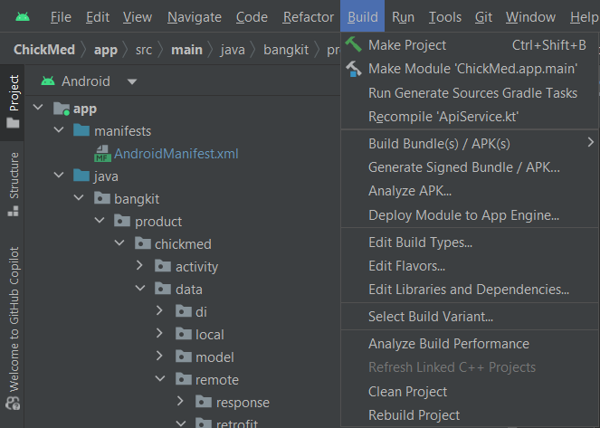
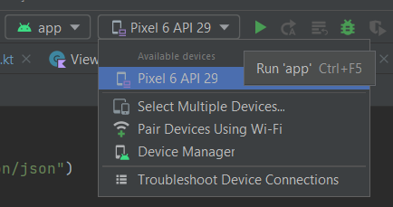
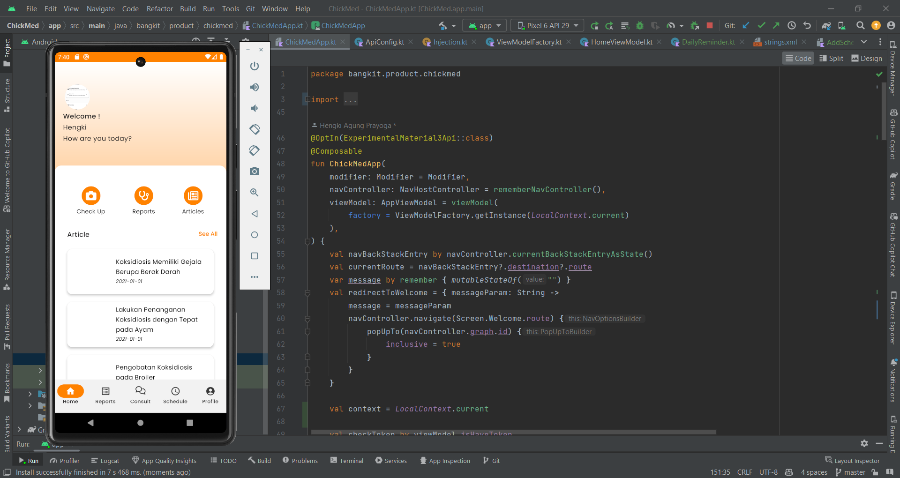
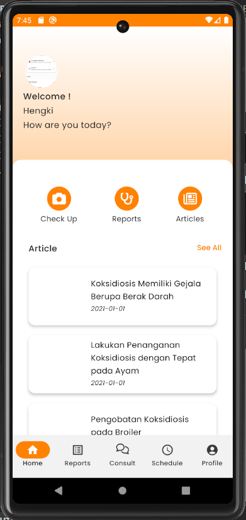
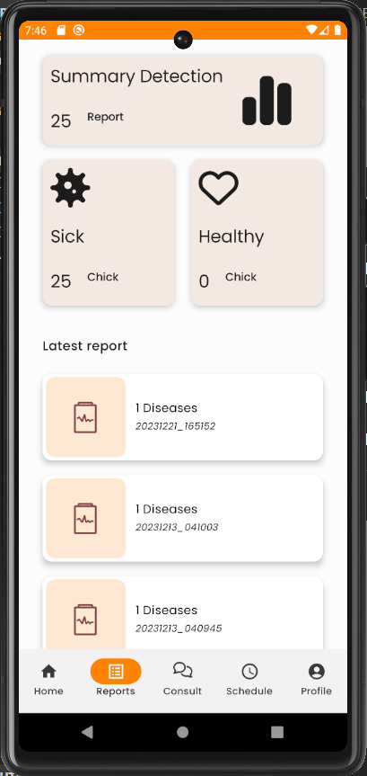
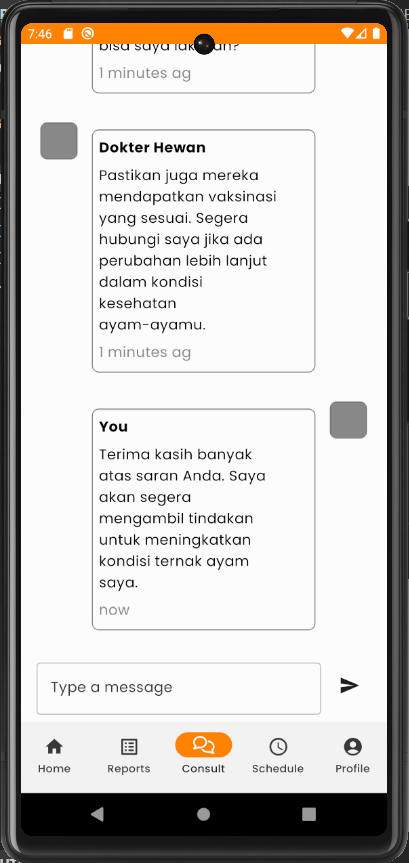
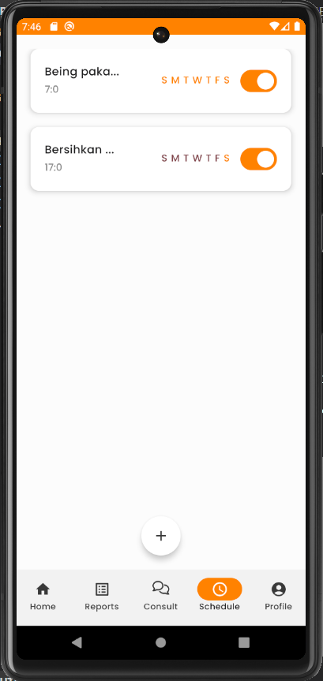
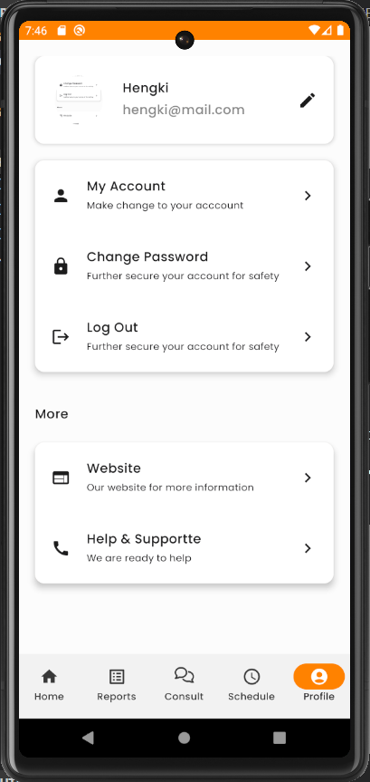

<h1 align="center">ChickMed - Chicken Disease Detection</h1>
<h2>🔭 Project Brief</h2>

#### We created an Android application that provides information about diseases suffered by the chicken. This application will provide recommendations on how to deal with the disease. We will use the image detection method to detect the disease suffered by chickens based on their feces.

## 🤖 Machine Learning Team

### Has several responsibility such as:

1. Cases Research
2. Data Collection & Exploration
3. Data Preparation
4. Modeling Experiment
5. Deployment
6. Evaluation & Monitoring

## 📱 Mobile Development Team

### Has several responsibility such as:

1. Making UI/UX
2. Implementing UI/UX
3. Implementing API and Real Time Data
4. Implementing Payment Gateway
5. Implement Notification System Alert
6. Implement Authentication and OTP
7. Making UI and Unit Testing

## ☁️ Cloud Computing Team

### Has several responsibility such as:

1. API Research
2. Database Integration
3. API Development
4. Admin Dashboard
5. Deploy Model
6. API Deployment
7. API Testing
8. API Fixing
9. API Documentation

## 🛠️ Installation Steps

1. Clone the repository

```bash
git clone https://github.com/HengkiAgung/chickmed-mobile
```

2. open AndroidStudio




3. Open The chickmed-mobile folder



4. Build the project by clicking Build->Make Module



5. Chouse the emulator and run the project



🌟 You are all set!


## ⚡Visit Our Website

You can visit our web at : http://35.219.37.188

## 📱TRY Our Aplication
By Downloading our app with the link below:
https://github.com/HengkiAgung/chickmed-mobile/releases/tag/1.7.0

## 📱 SCREENSHOT OF OUR APPLICATOIN
    

## 🏆 Contributor

1. Syair Dafiq Faizur Rahman (M200BSY0683) - ML - Universitas Diponegoro
2. Jihan Apriliani Nurhasanah (M116BSX1565) - ML - Institut Teknologi Kalimantan
3. Muhammad Insan Kamil (M116BSY0541) - ML - Institut Teknologi Kalimantan
4. Oktonius Zevanya Simanungkalit (C172BSY3184) - CC - Universitas Mikroskil
5. Andre Sevtian (C687BSY4375) - CC - - Universitas Muhammadiyah Bangka Belitung
6. Hengki Agung Prayoga (A116BSY2327) - MD -Institut Teknologi Kalimantan